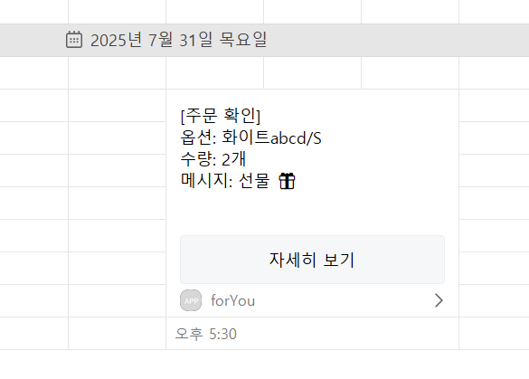

# spring-gift-order

# [step1] 카카오 로그인

## 구현 기능 목록
- [x] 카카오 계정 로그인 통한 인증 코드 발급 
- [x] 엑세스 토큰 추출 
- [x] 테스트 코드 작성 

## step1 리뷰 반영 
- [x] 카카오 api 매핑 및 타임 아웃 적용 
  - application.properties
    - kakao.base-url: https://kauth.kakao.com
      kakao.connect-timeout-ms: 2000
      kakao.read-timeout-ms: 3000
- [x] KakaoOAuthClient 분리
- [x] 단계별 로깅 

# [step2] 주문하기 

## 구현 기능 목록
- [x] 주문 생성 API 구현 (`POST /api/orders`)
- [x] 메시지 전송 Kakao API 연동
- [x] 주문 요청/응답 dto 작성
- [x] 주문 내역 메시지 작성
- [x] 나에게 보내기 
- [x] 테스트 코드 작성

### 주문하기 요청/응답 예시

### Request
```http
POST /api/orders HTTP/1.1
Authorization: Bearer {token}
Content-Type: application/json
```
```json
{
  "optionId":1,
  "quantity":2,
  "message":"선물 🎁"
}
```

### Response
```http
HTTP/1.1 201 Created
Content-Type: application/json
```
```json
{
  "id": 1,
  "optionId": 1,
  "quantity": 2,
  "orderDateTime": "2025-07-31T17:30:27.1750832",
  "message": "선물 🎁"
}
```



# [step3] 배포하기

## 구현 기능 목록
- [x] 배포 스크립트 작성
- [x] 실행 권한 및 배포 테스트
- [x] CORS 설정 추가
- [ ] 보안 설정 검토
- [ ] 테스트 코드 작성

### 배포 테스트
WSL 환경에서 작성한 배포 스크립트를 실행
```bash
$ chmod +x deploy.sh
$ ./deploy.sh
```
백그라운드 로그 파일(nohup.out) 통해 spring boot 실행 확인 
